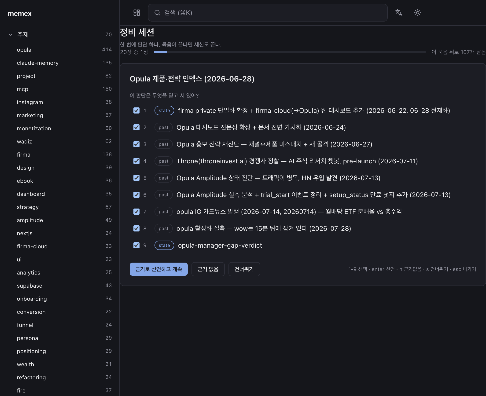
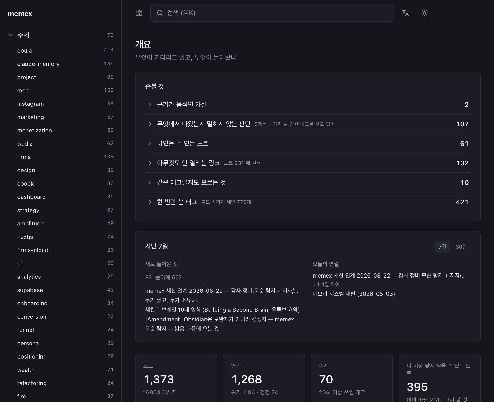
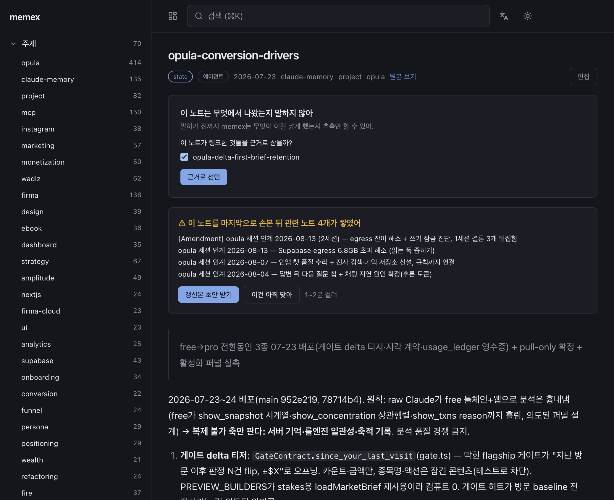
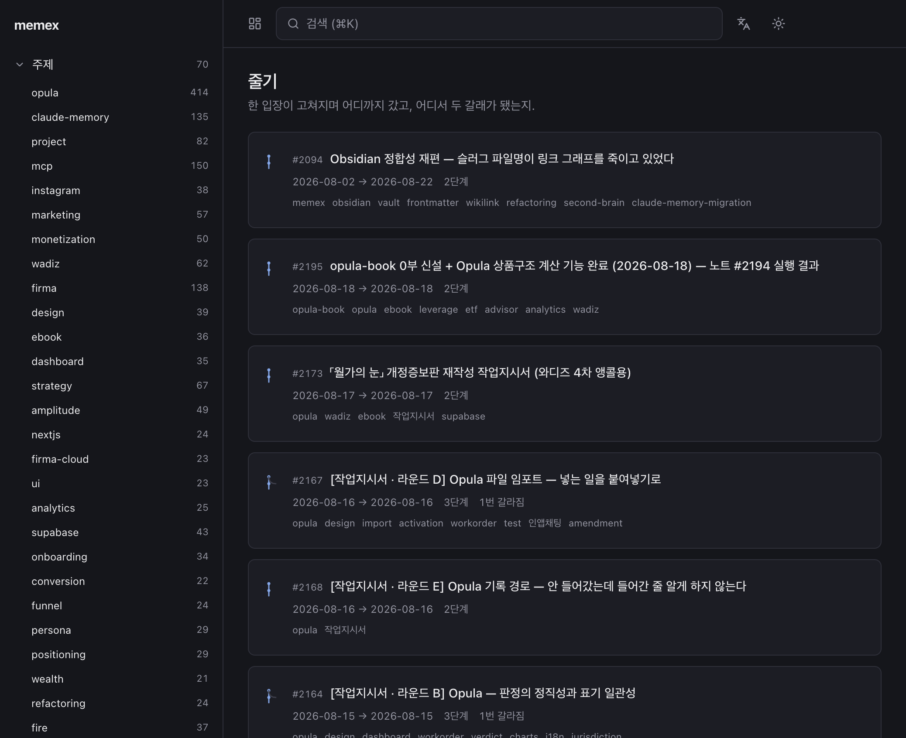

# UI v2 — 부채 명세서에서 오늘의 큐로

> [[엔진 v2 — 재는 것에서 판정을 준비하는 것으로]]가 판정 재료를 만든다.
> 이 문서는 그 재료를 사람이 1분 안에 처리할 수 있게 놓는 방법을 다룬다.
> 엔진 항목(E1~E18)을 그대로 참조하므로 그 문서를 먼저 읽어야 한다.

## 이 문서를 읽는 법

각 화면에 **현재 스크린샷 → 문제 → 제안 → 근거 → 반증**을 붙였다.
스크린샷은 `assets/2026-08-22-redesign/`에 있고 2026-08-22 실제 화면이다.
목업은 같은 폴더의 `05-proposed-mockup.html`을 브라우저로 열면 된다.

---

## 0. 한 줄 진단

**UI가 나쁜 게 아니라 정보 구조가 옵시디언 골격이다.**
사이드바로 훑고 노트를 읽는 구조인데, 이 제품에서 사람이 하는 일은 훑기가 아니라 **판정**이다.
노트 상세 화면은 이미 정답이다. 홈과 사이드바가 그 화면을 3급으로 밀어놨을 뿐이다.

---

## 1. 현재 라우트 감사

`apps/ui/src/App.tsx:133-143` 기준 라우트 10개.

| 라우트 | 인바운드 링크 | 상태 |
|---|---|---|
| `/` 개요 | 헤더 버튼 | |
| `/search` | 헤더 ⌘K | |
| `/note/:id` | 도처 | **이 앱에서 가장 잘 만든 화면** |
| `/topic/:tag` | 사이드바 70개 | |
| `/threads` 줄기 | 사이드바 (300개 리스트 아래) | 정보 우선순위 뒤집힘 |
| `/thread/:id` | `/threads`, 노트 상세 | |
| `/tags` | 사이드바, Chores 2곳 | |
| `/repair/evidence` | **Chores 카드 1곳뿐** | 제품의 심장이 3단계 깊이 |
| `/inference/:id` | Chores 1곳 | |
| `/topics` | **0개** | **죽은 라우트. 삭제 대상** |
| `*` | — | `<Navigate to="/" replace />` — 404 없음 |

사이드바(`Sidebar.tsx`) 6섹션:

```
1. memex
2. 주제 70           ← 70개 전부 나열
3. 지금 믿는 것 242   ← 242개 전부 나열
4. 지침 11
5. 줄기 / 태그
6. "기록 1120개는 위 주제 안에 있어 — 훑지 말고 검색으로 가."
```

**6번이 2·3번을 반박한다.** 훑지 말라면서 훑을 것을 300개 넘게 깔아뒀다.
접근성 트리가 감당 못 할 크기이기도 하다.

---

## 2. 화면별 설계

### U1. 판정 카드 (`/repair/evidence`) — 최우선



**문제.** 후보 페이로드가 `{id, title, layer, author, at}`뿐이다. 판정하려면 노트를 열 수밖에 없다.
카드 1장 = 36,559자 = 정독 52분. 20장 세션 = 10.8시간. (엔진 문서 §1.4)

**제안.** 목업 `assets/2026-08-22-redesign/05-proposed-mockup.html` §1 참조.

```
┌──────────────────────────────────────────────────────────────────┐
│ Opula 제품·전략 인덱스                                            │
│ [state] 작성 2026-06-28 · 마지막 수정 2026-08-01 · 인덱스형 · 9,419자│  ← U1-a
│                                                                   │
│ 이 노트가 하는 주장 1 / 4:                                         │  ← U1-b
│ ┌──────────────────────────────────────────────────────────────┐ │
│ │ "Opula의 유료 경계는 장부 무료 / 두뇌 유료이고,                │ │
│ │  결제는 Lemon Squeezy MoR을 쓴다."                            │ │
│ └──────────────────────────────────────────────────────────────┘ │
│                                                                   │
│ 이 주장을 딛고 있는 것은?                                          │
│ ☑ 1 [state] firma private 단일화 확정 + firma-cloud 웹 대시보드   │
│      └ "firma를 Opula로 리브랜딩" 결정이 여기서 나왔고,            │  ← U1-c
│        이 주장이 그 이름을 전제함                                  │
│ ☑ 2 [past] Opula 유료화 전략 확정 — 장부무료/두뇌유료 + LS MoR    │
│      └ 주장 문장과 거의 그대로 일치. 2026-06-25, 3일 앞섬          │
│ ☐ 3 [past] Throne 경쟁사 정찰                                     │  ← U1-d
│      └ 경쟁사 기록. 유료 경계 주장과 무관 — 근거 아님으로 추정      │
│                                                                   │
│ [선언 ⏎] [근거 필요 없는 주장 · N] [이 노트는 인덱스라 전부 제외·X] │  ← U1-e
│ 1-4 토글 · ⏎ 선언 · N 근거 불필요(영구) · X 노트 제외 · S 나중에    │
└──────────────────────────────────────────────────────────────────┘
```

**바뀐 것 5개:**

| | 무엇 | 엔진 항목 | 근거 |
|---|---|---|---|
| U1-a | `updated_at`을 헤더에 노출 | — | 엔진 §1.5. 지금은 `authored_at`만 보여서 사람이 "대상보다 나중이니 근거일 리 없다"고 **정당하게 오판**한다. 실제로 후보 9개 중 5개가 07월 노트인데 `updated_at`(08-01) 기준으로는 정당하다 |
| U1-b | 판정 단위를 문서 → 주장 | **E6** | 9,419자 인덱스 노트에 "무엇을 딛고 있나"는 답할 수 없는 질문. Dense X Retrieval R@5 43.0→52.7 |
| U1-c | 후보마다 "왜 근거인가" 한 줄 | **E5** | 노트를 안 열고 판정 가능. 52분 → 1분 |
| U1-d | 확신 낮은 후보는 기본 해제 | **E7** | 도장 찍기 방지. ACM TiiS 2024: AI 보조가 전문가는 오히려 악화시킴 |
| U1-e | 영구 출구 2개 (`N` 근거 불필요 / `X` 노트 제외) | **E8** | 지금은 `S 건너뛰기`뿐이고 그건 다시 돌아온다는 뜻 |

**유지할 것.** 카드스택 + 키보드 전용 규약. CHI 2023 "Interface Design for Crowdsourcing Hierarchical
Multi-Label Text Annotations"(18,000+ 주석, 인터페이스 6종 비교): 단일 패스 완전 라벨링이 희소 라벨링보다
**최대 9배 처리량**. 이진 라벨링은 계층 다중라벨 패스 대비 **8.8배 비용**. 현재 설계가 옳다.

**같이 고칠 버그.** 진행 표시가 "20장 중 1장" 옆에 "이 묶음 뒤로 107개 남음"인데 107은 전체 개수다.
20장을 다 해도 107이 그대로다. 87이 맞다.

**반증.** E5의 사유 한 줄 정확도가 80% 미만이면(엔진 E5 반증 조건) U1-c를 빼고 U1-b만 먼저 하라.
사유가 부정확하면 지금보다 **더 나쁜** 판정을 유도한다.

---

### U2. 홈 (`/`) — 대시보드에서 큐로



**문제.** "손볼 것" 6줄 합계 733. 안 줄어들고, 6줄 중 3줄은 목적지도 없다.
`Chores.tsx` 기준 목적지 유무:

| 카드 | 개수 | 목적지 |
|---|---|---|
| 근거가 움직인 가설 | 2 | `/inference/:id` |
| 무엇에서 나왔는지 말하지 않는 판단 | 107 | **`/repair/evidence` (유일한 세션)** |
| 낡았을 수 있는 노트 | 61 | `/note/:id` 나열만 |
| 아무것도 안 열리는 링크 | 132 | `/note/:id` 나열만 |
| 같은 태그일지도 모르는 것 | 10 | `/tags` |
| 한 번만 쓴 태그 | 421 | `/tags` |

그리고 **홈은 노트 상세 화면의 열화 복제본이다.** 노트 상세는 같은 정보를 문맥과 액션과 함께
보여주는데(U3), 홈은 문맥과 액션을 벗겨 숫자로 집계한다.

**제안.**

```
┌──────────────────────────────────────────────────────────────┐
│ 오늘 9장                                                      │
│ 다 하면 끝. 나머지는 오늘 볼 필요 없어.                        │
│                                                               │
│ [지금] 근거가 무너진 판단  · #1642가 딛던 기록이 정정됨   2장  │
│ [지금] 확인 필요한 판단    · 반박 기록이 3개 이상 쌓임    4장  │
│ [곧 ] 근거 미선언         · 자주 인용되는 것부터         3장  │
│                                                               │
│ [시작 ⏎]                                                      │
│ ───────────────────────────────────────────────────────────  │
│ 묻어둔 것 — 눌러야 보임                                        │
│ 아마 아직 맞음 30 · 근거 불필요로 선언됨 92 ·                  │
│ 플레이스홀더로 무시 118 · 나중에 볼 태그 421                   │
└──────────────────────────────────────────────────────────────┘
```

**733 → 9 경로 (전부 엔진 항목에 대응):**

| 단계 | 무엇 | 엔진 | 잔여 |
|---|---|---|---|
| 0 | 원본 | | 733 |
| 1 | 클래스 단위 기각 (플레이스홀더·태그 유예) | **E4** | 194 |
| 2 | 근거 불필요 유형 분리 | **E8** | ~102 |
| 3 | 우선순위 = 검색빈도 × 미근거도 × 중심성 | **E8+E9** | ~30 |
| 4 | warn/error 2단 임계값 → 오늘 것만 | **E16** | **9** |

**⚠️ 위 숫자 194 / 102 / 30 / 9는 추정이지 측정이 아니다.**
E4·E8·E16이 구현된 뒤 실제로 재야 한다. 1단계만 측정 근거가 있다(dangling 156건 중 확인된
반례 출처 6개, 엔진 §1.6 — 나머지는 전방 링크일 가능성이 높아 클래스 기각 대상이 더 넓을 수 있음).

**반증.** 4단계를 다 거쳤는데 오늘 치가 30장을 넘으면 임계값이 틀린 것이다. 목표는 **한 자리 수**다.
"오늘 40장"은 "733"과 심리적으로 같다.

**⚠️ 규약 충돌.** `CLAUDE.md` 표면 정책이 이렇게 못박고 있다:

> Signals appear here as annotations in context, never as a queue to work through.

현재 구현은 이미 이걸 위반한다(손볼 것 카드, `/repair/evidence` 둘 다 큐).
U2는 위반을 **줄이되 없애지는 않는다** — 유한하고 오늘 끝나는 세션이라는 점이 다르다.
**규약 개정 없이 U2를 구현하지 마라.** 제안 문구:

> Signals appear in context as annotations, and in a finite daily session that empties.
> Never as a standing backlog counter.

---

### U3. 노트 상세 (`/note/:id`) — 이미 정답, 4가지만 추가



플래그된 `state` 노트(#1948)를 열면 한 화면에:

- `이 노트는 무엇에서 나왔는지 말하지 않아` + 후보 체크박스 + `근거로 선언` (`Evidence.tsx`)
- `⚠️ 이 노트를 마지막으로 손본 뒤 관련 노트 4개가 쌓였어` + 제목 4개
  + `갱신본 초안 받기` / `이건 아직 맞아` + "1~2분 걸려" (`StalePanel.tsx`)

**이게 JIT다. 이미 구현돼 있다.** 문맥 안에, 판단이 필요한 순간에, 소요 시간까지 붙여서.
그리고 `이건 아직 맞아`(`api.stillTrue`)가 여기 있다 — 확인은 부정만큼 중요한 데이터인데
정비 세션에는 이 감각이 없다.

**추가할 4가지:**

| | 무엇 | 엔진 | 왜 |
|---|---|---|---|
| U3-a | **역방향 근거** — "무엇이 이 판단을 딛고 있나" | **E14/E15** | 지금은 정방향 후보만 제안한다. 역방향이 있어야 "이걸 버리면 뭐가 같이 무너지나"를 볼 수 있고, 그게 entrenchment 점수의 in-degree 항이다 |
| U3-b | **유효 기간** — `valid_from ~ valid_to` 배지 | **E13** | "2026-06-22 ~ 2026-07-12에 맞았음"이 `past` 배지보다 훨씬 많은 걸 말한다 |
| U3-c | **믿는 이유 체인** — JTMS `support` 역추적 | **E15** | "이걸 믿는 이유 → 그 이유 → 그 이유". Doyle 1979의 `support` 포인터 역추적이 공짜로 만드는 화면. 경쟁 제품에 없다 |
| U3-d | **정정 이력 인라인** | — | `amends` 74건이 `/threads`로 분리돼 있는데, 정정은 그 노트에 대한 사실이지 독립 화면 주제가 아니다. 노트 안에 접힌 채로 있어야 한다 |
| U3-e | **낡음 패널에 diff 한 줄** | **E16** | 지금은 "쌓인 노트 제목 4개". 필요한 건 "그 4개가 이 판단의 어느 문장과 부딪히나 — 한 줄". Panthaplackel et al. AAAI 2021의 핵심 설계 결정이 입력을 산출물이 아니라 **diff**로 잡은 것 |

**반증.** U3-a/c는 `note_evidence`가 채워진 뒤에만 의미가 있다. 지금 0행이므로
**E5·E6·E18이 먼저다.** 빈 패널을 먼저 그리지 마라.

---

### U4. 사이드바 — 접는다

**문제.** 300+ 항목 평면 리스트. 6번 섹션이 스스로 "훑지 말고 검색으로 가"라고 말한다.

**제안.**
- `지금 믿는 것 242` → 최근 N개(8~12) + "전체 보기" 링크
- `주제 70` → 상위 N개 + "전체 보기"
- 기본 접힘. ⌘K를 1급 진입점으로.
- `/topics` 라우트 삭제 (인바운드 0)
- `<Route path="*">`를 홈 리다이렉트에서 404 화면으로

**반증.** 사이드바를 접었더니 사용자가 태그 탐색을 못 하겠다고 하면 되돌린다.
다만 **6번 섹션의 문구가 이미 그 방향을 지시하고 있다** — 문구를 지우든 리스트를 줄이든
둘 중 하나는 해야 한다. 지금은 모순이다.

---

### U5. 줄기 (`/threads`) — 정보 우선순위를 뒤집는다



**문제.** 한 행이 이렇게 생겼다:

```
#2094  Obsidian 정합성 재편 — 슬러그 파일명이 링크 그래프를 죽이고 있었다
       2026-08-02 → 2026-08-22   2단계
       [memex][obsidian][vault][frontmatter][wikilink][refactoring][second-brain][claude-memory-migration]
```

태그 칩 8개가 시각 무게의 절반을 먹는데, **이 화면에서 태그는 가장 안 중요한 정보다.**
정작 핵심인 `2단계`, `1번 갈라짐`은 회색 작은 글씨다.

**제안.** 태그 칩 제거. `2단계 · 1번 갈라짐`을 제목 다음 위계로 승격.
"이 입장이 몇 번 뒤집혔고 어디서 갈라졌나"가 이 화면의 유일한 질문이다.

**반증.** 태그로 줄기를 필터링하는 사용 패턴이 있으면 칩 대신 필터 UI로 옮긴다. 삭제가 아니라 이동.

---

## 3. 레퍼런스 — 이 문제를 이미 푼 앱들

CC가 UI를 그릴 때 참고할 것. 공통점: **어느 것도 사람에게 원문 전체를 읽히지 않는다.**

| 앱 | 훔칠 것 | 측정된 효과 | URL |
|---|---|---|---|
| **ASReview** | 능동학습 우선순위 큐. 사람은 oracle, 기계는 순위만. "충분히 봤다"고 판단되면 중단하는 것이 **정상 종료** | 스크리닝 부하 최대 95% 감소 주장 / 독립 검증 평균 60.2% | https://asreview.nl · Nature Machine Intelligence 3, 125-133 (2021) |
| **TAR / CAL** | 전수 검토를 포기하는 것이 정답이라는 증명. 법률 e-discovery 표준 | — | Cormack & Grossman, arXiv 1504.06868 |
| **Prodigy** | 가능한 가장 작은 질문으로 쪼개기. 이진 결정 + 키보드 + 모델 인더루프 | — | https://prodi.gy |
| **Snorkel** | 한 건씩 라벨링 대신 **규칙**으로 한 번에 수천 건 (→ U1-e의 `X 노트 제외`, E4의 클래스 기각) | 전문가 모델 구축 2.8배 빠름, 예측성능 +45.5% | arXiv 1711.10160 |
| **Dependabot** | **사유를 붙여 기각.** 기각도 데이터로 남고 나중에 다시 열 수 있음 | — | https://docs.github.com/code-security/dependabot |
| **Renovate** | 연관 항목을 그룹으로 묶어 한 건으로 + 승인 워크플로 | — | https://docs.renovatebot.com/key-concepts/dashboard |
| **Sentry** | 이벤트 그룹핑 + **suspect commit**(원인 후보를 기계가 지목) + 실행가능성 기준 우선순위 | 새 그룹핑 모델로 중복 이슈 20% 추가 차단, 오병합 절반 | https://docs.sentry.io/product/issues/suspect-commits |
| **Guru** | 카드마다 검증자 배정 + 자동 아카이브 큐 + "Up First"(조회수·최신성 가중 정렬) | — | https://www.getguru.com/features/verification |
| **Anki / FSRS** | 항목별 다음 검토일. 카운터가 아니라 오늘 치 큐 | 동일 유지율에서 복습량 ~25% 감소 | https://github.com/open-spaced-repetition |

ASReview는 오픈소스(Apache-2.0)이고 화면 구조를 직접 볼 수 있다: https://github.com/asreview/asreview

**Guru의 "Up First"가 U2의 우선순위 정렬과 정확히 같은 문제의 답이다.** 개수가 아니라 조회수·최신성
가중으로 정렬해서 영향 큰 것부터 처리하게 한다. memex에서는 E9(MCP 검색 로그)가 그 데이터다.

---

## 4. 남길 것 / 버릴 것

| 지금 UI | 판정 | 근거 |
|---|---|---|
| 정비 세션 카드스택 + 키보드 규약 (1-9/⏎/N/S/Esc) | **유지.** 나머지 5종에도 확대 | CHI 2023 단일패스 9배 처리량 |
| 노트 상세의 근거 선언 + 낡음 패널 + `이건 아직 맞아` | **유지.** 이 앱 최고 화면 | JIT 문헌 전체 |
| 후보 전부 pre-check | **조건부 폐기** → 확신도별 선택적 (E7) | ACM TiiS 2024 |
| 줄기 개념 | **유지**, 태그 칩만 제거 (U5) | |
| 홈 "손볼 것" 6줄 카운터 | **폐기** → 오늘의 큐 (U2) | 규약 개정 선행 필요 |
| 사이드바 전체 나열 | **폐기** → 최근 N개 + ⌘K (U4) | 사이드바 자체 문구가 근거 |
| `/topics` | **삭제** | 인바운드 링크 0 |
| 없는 라우트 → 홈 리다이렉트 | **404로** | 링크 무결성을 파는 제품 |

---

## 5. 구현 순서 (엔진 의존성 포함)

```
0단계 (엔진만, UI 변화 없음)  ← 2026-08-22 완료
  E9  MCP 검색 로그          ← 모든 측정의 전제                    [완료]
  E1  FTS 접두 *             ← 원안 기각, 0.3 가중 별도 arm으로 채택 [완료]
  E2  RRF_K 스윕             ← 측정 완료, 60 유지로 닫음            [닫음]

1단계 (UI 변화 시작)  ← 2026-08-22, E5 제외 완료
  E5  후보별 사유 한 줄  →  U1-c   ← 노트 72% / 주장 87%(무작위 89%). 보류  [보류]
  U1-a  updated_at 노출          ← 엔진 의존 없음. 지금 당장 가능
  U5    줄기 태그 칩 제거        ← 엔진 의존 없음
  U4    사이드바 축소 + /topics 삭제 + 404  ← 엔진 의존 없음

2단계
  E6  주장 단위 분해     →  U1-b
  E7  선택적 pre-check   →  U1-d      (E5 필수 선행)
  E4  죽은 링크 유형 분리 →  U1-e 클래스 기각
  E8  우선순위 + 영구 기각 → U2 (E9 필수 선행)

3단계 (규약 개정 후)
  U2  홈을 큐로
  E16 낡음 등급 → U2의 warn/error 분리

4단계 (note_evidence가 채워진 뒤)
  E13 valid_from/to  →  U3-b
  E14 justification 그룹
  E15 JTMS 다홉      →  U3-a, U3-c
  E18 쓰기 시점 근거 (JIT)
```

**U1-a, U4, U5는 엔진 의존이 없다. 오늘 바로 할 수 있고 되돌리기도 쉽다.**

---

## 6. 열린 질문

1. **규약 개정.** §U2의 `CLAUDE.md` 충돌. 사용자 결정 필요.
2. **`이건 아직 맞아`를 정비 세션에도 넣을 것인가.** 노트 상세에는 있는데 세션에는 없다.
   확인 이벤트는 E16 생존분석의 censored 관측을 만드는 데이터이므로 넣는 게 맞아 보이지만,
   세션 흐름에 버튼을 하나 더 넣는 비용이 있다.
3. **목업의 색·간격을 그대로 쓸 것인가.** `05-proposed-mockup.html`은 현재 다크 테마를 근사한 것이지
   디자인 토큰을 읽어서 만든 게 아니다. **CC는 실제 `styles.css`/`theme.ts`의 토큰을 쓰고
   목업의 색값을 복사하지 마라.**
