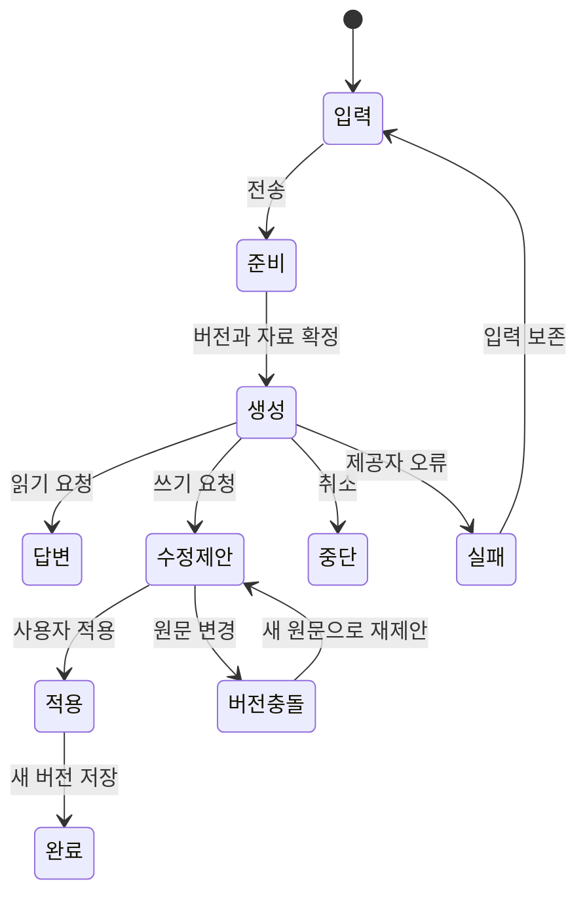

# memex 경험 설계 v1

상태: 구현 가능한 설계 제안. 화면 구현·런타임 정책 변경은 하지 않았다.
기준: [제품 재설계](2026-09-08-second-brain-product-redesign.md).
관련: [데이터·동작 계약](2026-09-08-memex-domain-contract.md), [Claude Code 인수인계](2026-09-08-memex-implementation-handoff.md).

## 1. 이번 설계에서 고정하는 것

- 사람은 직접 기록하고 쓴다. AI는 같은 볼트에서 근거를 찾고, 제안하고, 허용된 기억을 남긴다.
- 앱의 중심은 문서 작업이다. 기억 확인은 독립적으로도, 관련 문서 안에서도 가능하다.
- 첫 검증 시나리오는 기존 자료를 참고한 긴 글 작성이다. 프로젝트 계획 수정과 외부 대화의 정정도 필수 검증한다. 글쓰기 전용 제품으로 제한하지 않는다.
- Electron, React, CodeMirror, Markdown, 기존 색상 토큰·Pretendard·밝은/어두운 테마를 재사용한다. 이번 설계는 시각 브랜드 교체가 아니다.
- 제안 화면은 아래 구조 와이어프레임과 상태 계약으로 정의한다. 픽셀 시안이나 작동하는 시제품을 검증했다고 주장하지 않는다.
- v1 범위는 단일 사용자·로컬 볼트·현재 데스크탑 배포 환경이다. 동기화·협업·발행·새 그래프·별도 프로젝트 DB는 제외한다.

## 2. 대표 작업과 완료 장면

예시 데이터는 설계용 가상 자료다. 사용자의 실제 개인정보가 아니다.

| ID | 시작 | 끝 |
|---|---|---|
| J1 작성 | ‘AI와 일하며 달라진 것’이라는 생각과 기존 작업 기록 3개 | 참고 자료가 연결된 원고를 저장하고 재실행 후 같은 위치에서 계속 작성 |
| J2 이어가기 | 외부 AI에서 ‘지난번 출시 계획으로 카피 써줘’ | 현재 계획을 조회하고 새 카피를 초안으로 남겨 앱에서 이어 편집 |
| J3 정정 | ‘출시는 9월이 아니라 10월이야’ | 9월의 기록은 남고 현재 값은 10월, 다음 조회가 둘을 구별 |

## 3. 정보 구조와 이동

```text
memex
  새 문서                         [⌘N]
  홈                              /
  라이브러리                      /library
  검색                            /search
  기억                            /memory
  ───────────────────────────────
  폴더                            기존 트리
  ───────────────────────────────
  설정                            /settings

문서 탭                           /note/:id 유지
기억 상세                         /memory/:subjectKey
AI / 참고 자료 / 문서 정보         문서 옆 패널, 독립 목적지 아님
```

주 내비게이션에 건수 배지를 달지 않는다. 폴더 개수는 탐색 정보로만 표시 가능하다. 규칙 승인 등 중요한 항목은 기억 화면과 홈의 관련 변경에 내용으로 표시한다.

라우트 호환:

- `/note/:id`, `/new`, `/search`, `/settings` 유지.
- `/register`, `/register/:subject`는 새 기억 화면으로 연결하되 기존 인코딩·딥링크 처리 보존.
- `/topic/:tag`, `/thread/:id`, `/inference/:id`는 검색/기억 상세의 보조 화면으로 계속 접근 가능.
- `/today`, `/tags`, `/repair/evidence`, `/rules`는 설정 또는 관련 화면에서 접근. v1에서 삭제하지 않는다.
- 현재 앱의 채팅은 패널이다. 과거 문서의 `/chat` 설명을 근거로 새 전체 화면 채팅을 만들지 않는다.

## 4. 공통 셸과 재진입

macOS 창 버튼과 드래그 영역은 유지한다. 메뉴/버튼/탭은 드래그 영역에서 제외한다.

- 기본 사이드바 208px, 조절 범위 180~280px. 좁은 창에서는 접는다.
- 문서 본문은 가변 폭, 읽기 열의 권장 최대 폭 720px. 본문 16px, 줄높이 1.75를 초기값으로 한다. UI 글자는 13~14px. 장문 한국어의 가독성을 우선한다.
- 오른쪽 패널은 기본 360px, 320~480px로 조절. AI/참고/정보 탭으로 전환한다.
- 1280px 이상: 사이드바·문서·오른쪽 패널. 960~1279px: 패널을 열 때 사이드바 자동 접기. 960px 미만: 오른쪽 패널을 접근 가능한 오버레이로 열며 문서 상태 유지.
- 1600px 이상에서는 참고 문서를 분리해 문서·참고·AI를 함께 볼 수 있다. 좁은 창에서 이를 강제하지 않는다.
- 마지막 활성 문서·탭 순서·커서·스크롤·패널 폭을 볼트별로 복구한다. 사용자가 홈에서 종료했으면 홈으로 돌아온다.
- 삭제/접근 불가 문서로 재진입하면 다른 탭을 보존하고 ‘이 문서를 찾을 수 없어요’와 라이브러리 이동 제공.

## 5. 홈

```text
┌ 내비게이션 ───┬─────────────────────────────────────────────┐
│ 새 문서       │ 이어서 작업하기                 [새 문서]   │
│ 홈           │ AI와 일하며 달라진 것                       │
│ 라이브러리   │ 마지막으로 쓰던 문단…           [계속 쓰기] │
│ 검색         │                                             │
│ 기억         │ 최근 문서                                   │
│              │ 출시 계획                 오늘 수정          │
│ 폴더         │ 인터뷰 메모               어제 수정          │
│              │                                             │
│ 설정         │ 작업과 관련된 변경                          │
│              │ 출시 계획의 근거가 바뀌었어요   [비교하기]   │
└──────────────┴─────────────────────────────────────────────┘
```

‘이어서 작업하기’는 마지막으로 직접 편집한 문서 1개, 최근 문서는 최대 8개다. 최근 수정과 최근 열람을 섞지 않으며 목록의 기준을 표시한다. 작업 중 상태는 선택적이며 AI가 자동 지정하지 않는다.

관련 변경은 최근 열거나 편집한 문서에 직접 연결된 근거 변경·충돌만 최대 3개 표시한다. 없으면 섹션 전체를 생략한다. 확인 가능한 구조적 변화만 제시하고 ‘안전하다’는 포괄 판단을 하지 않는다.

빈 볼트: ‘첫 생각을 남겨보세요’ → [새 문서] / [기존 폴더 연결]. 튜토리얼용 가짜 노트를 자동 삽입하지 않는다.
가져오는 중: 이미 읽을 수 있는 파일을 표시하고 진행 상태를 덧붙인다. 전체 완료까지 앱을 잠그지 않는다.

## 6. 라이브러리와 검색

라이브러리는 기존 폴더를 그대로 보여주며 문서 종류 필터(전체/내 글/참고 자료/지침), 제목·수정일 정렬을 제공한다. 종류를 모르는 문서는 전체에 남는다. ‘내 글’은 사용자 지정 또는 확실한 작성 근거가 있는 경우만 포함한다. 과거 author 기본값을 소유권의 증거로 쓰지 않는다.

검색 결과 한 행:

```text
출시 일정 변경                         프로젝트 / 출시
“출시 목표를 10월로 옮겼다. 이유는…”     9월 8일 수정
현재 계획 · 근거 2개                   [열기] [참고에 추가]
```

- 실제 맞은 구절을 보여준다. 문서 전체가 폐기된 것처럼 표시하지 않고 해당 주장에만 상태를 붙인다.
- ⌘K는 문서/명령 빠른 이동, 전역 검색 버튼은 `/search`, ⌘F는 현재 문서 찾기다.
- 오른쪽 참고 탭에서는 같은 검색 기능을 사용하되 주 문서와 커서 위치를 유지한다.
- 검색 모델 준비 전에는 전문 검색으로 작동하며 ‘지금은 단어로 찾고 있어요’ 표시. 뜻 검색 준비 버튼 제공.
- 결과 없음: 검색어 유지, 적용 필터 표시, [필터 지우기]. AI 답변으로 빈 결과를 위장하지 않는다.
- 참고 추가는 원본 문서를 복제하지 않고 버전·인용 구절을 연결한다.

## 7. 문서 작업 화면

```text
┌ 내비 ──┬ 원고 탭 ───────────┬ 출시 계획 탭 ──────────────────┐
│        │ 글 / 에세이                       저장됨   [⋯]     │
│        ├──────────────────────────┬──────────────────────────┤
│        │ AI와 일하며 달라진 것     │ AI | 참고 3 | 정보       │
│        │                          │                          │
│        │ 처음에는 대답을 얻으려고 │ 대상: 선택한 문단         │
│        │ AI를 썼다. 이제는…       │ 참고: 작업 기록, 기존 글  │
│        │                          │ 지침: 담백하게 쓰기       │
│        │ [선택된 문단]            │                          │
│        │                          │ 문단을 더 구체적으로…    │
│        │                          │             [요청 보내기]│
└────────┴──────────────────────────┴──────────────────────────┘
```

새 문서는 즉시 빈 편집기를 연다. 제목·레이어·태그 모달을 선행하지 않는다. 제목이 없으면 ‘제목 없음’으로 보이며 파일 경로는 제목 변경과 독립적으로 안정적이다. 첫 의미 있는 입력 후 문서가 생성된다. 완전히 빈 새 탭은 닫을 때 파일을 만들지 않는다. 기존 문서 본문을 모두 지우는 것은 정상 편집으로 저장하고 이력으로 복구한다.

직접 작성한 문서는 편집으로, 참고 문서는 읽기로 연다. 사용자가 선택한 모드를 문서별로 기억한다. 이전 문서의 소유권을 모르면 읽기로 시작하고 [원문 편집]은 제공한다. 문서 유형이 의미적 기억 보존 정책을 우회하지 않도록 아래 계약을 따른다.

헤더: 폴더/문서 위치, 저장 상태, 읽기·편집 전환, AI 열기, 더보기. 제목은 본문과 두 번 입력하지 않으며 기존 제목 추출/프런트매터 보존 로직을 재사용한다.

더보기: 문서 정보, 변경 이력, Markdown 복사/파일 위치 열기, 이동/이름 변경, 휴지통. ‘완성’ 표시는 작성 상태일 뿐 공개 발행이나 사실 확인이 아니다.

### 저장·탭 상태

| 상태 | 표시 | 동작 |
|---|---|---|
| 입력 중 | 저장 대기 | 로컬 복구 초안 기록 |
| 저장 중 | 저장 중… | 같은 문서의 쓰기 직렬화, 최신 입력 유지 |
| 완료 | 저장됨 | 서버가 확인한 버전까지만 완료 처리 |
| 실패 | 저장하지 못했어요 · 다시 시도 | 편집 유지, 초안 보존, 텍스트 복사 가능 |
| 외부 변경 | 다른 곳에서 수정됐어요 · 비교 | 자동 덮어쓰기 중단, 내 초안/현재 원본 나란히 표시 |

일반 입력은 900ms 유휴 후 저장한다. ⌘S는 즉시 flush. IME 조합 중에는 중간 문자열을 확정 저장하지 않는다. 탭 이동은 초안을 유지하고 저장을 이어간다. 창 종료는 저장/복구 초안의 영속화를 확인하고, 실패 시 닫기를 막고 설명한다. 컴포넌트 unmount의 fire-and-forget 저장만으로 종료 보장을 구현하지 않는다.

## 8. AI 패널

AI는 문서 중심의 도우미다. v1에는 독립적인 범용 채팅 홈을 추가하지 않는다. 문서가 없는 홈/검색에서도 질문은 가능하지만 기존 문서의 변경 대상은 자동 추정하지 않는다.

요청 입력 위에 항상 다음을 표시한다:

- 대상: 선택 영역 / 현재 문서 / 질문만. 선택 영역의 요청은 그 범위 밖을 수정하지 않는다.
- 참고: 현재 문서 + 사용자가 고른 자료. 기본은 선택 자료 안에서 검색. ‘볼트에서도 찾아보기’를 켜면 허용된 범위만 추가 검색하고 실제 사용 자료를 결과에 표시한다.
- 지침: 이번 작업에 적용할 스킬. 선택하지 않은 글쓰기 스킬은 자동 주입하지 않는다. 기존 승인된 기본 규칙은 별도 ‘기본 규칙’에서 확인 가능하다.
- 제공자: Claude/Codex 등 실제 연결된 제공자와 상태. 로컬 저장이 외부 AI에 자료를 전달하지 않는다는 뜻으로 안내하지 않는다.

추천 동작은 고정 대화문 대신 ‘개요 잡기’, ‘이어서 쓰기’, ‘선택 문단 다듬기’, ‘근거 찾기’ 정도로 제한한다. 선택이 없으면 선택 문단 동작은 숨긴다.

### 요청과 결과



- 설명/검색 결과: 인용 출처를 눌러 원문 구절 열기.
- 쓰기 결과: 원문/제안 비교 + [적용] [다시 요청] [버리기]. 생성 스트림은 원문에 직접 쓰지 않는다.
- v1 부분 적용은 요청 당시 선택 범위 하나를 단위로 한다. 여러 diff 조각 중 임의 선택하는 기능은 후순위다.
- 적용 전에 문서가 바뀌면 자동 재배치하지 않는다. 새 버전에 다시 제안하도록 한다.
- 생성 취소 후에도 이미 표시된 내용은 제안으로 남길 수 있지만 원문은 바뀌지 않는다.
- 적용 후 [되돌리기]는 새 버전을 만드는 복원이다. 이후 편집이 있으면 비교를 거쳐 복원한다.
- 문서를 전환해도 실행 중인 요청은 원래 문서에 묶인다. 다른 문서에 결과를 적용하지 않는다.
- 사용된 출처 목록과 실제 참고 구절을 보여주되, 모델이 검색한 것과 최종 답에서 인용한 것을 구별한다.

## 9. 기억 목록과 상세

기억 목록은 구현 테이블별 목록 대신 주제별로 묶는다. v1 주제는 기존 register subject와 명시적 연결을 사용한다. 없는 주제를 LLM으로 대량 생성하지 않는다. 주제 미연결 항목은 ‘주제 미지정’으로 접근한다.

```text
기억 / 출시 계획

현재 기록된 내용
출시 목표: 10월                  사용자 정정 · 9월 8일
[내용 바꾸기] [더는 사용하지 않기]

근거
출시 회의 기록 · “준비 기간을 확보하기 위해…” [원문]

변경 이력
9월 8일   9월 → 10월             사용자 정정
8월 20일  9월                    AI가 대화에서 기록

확인이 필요한 내용
출시 소개 글에는 아직 9월이라고 적혀 있어요. [비교]
```

상태 문구: ‘AI가 기록’, ‘사용자 확인’, ‘근거 변경’, ‘서로 다른 기록’, ‘더는 사용하지 않음’. 검색 품질 점수를 사실의 확률처럼 보여주지 않는다. 사용자가 확인해도 미래의 정확성을 보장하지 않는다.

정정은 같은 자리의 작은 폼에서 끝낸다. 기존 내용, 새 내용, 선택적 이유, [반영]을 제공한다. 새 내용을 모르면 [더는 사용하지 않기]로 폐기하고 대체 값 없이 남길 수 있다. 다른 문서의 원문까지 일괄 수정하지 않는다.

완료 문구: ‘출시 목표를 10월로 기록했어요. 다음 조회에서 이 변경을 함께 전달해요.’ 외부 AI가 반드시 지킨다고 표현하지 않는다. [변경 내용 보기]와 [되돌리기] 제공.

규칙 승인은 기억 화면의 별도 필터로 접근하고 적용 범위를 확인하게 한다. 일시적인 글쓰기 지침 선택과 전역 규칙 승인을 같은 동작으로 만들지 않는다.

## 10. 처음 시작하기와 설정

1. ‘새 볼트 만들기’ 또는 ‘기존 폴더 사용’. 기존 폴더 사용은 파일 복사/재분류 없이 연결한다.
2. 로컬 문서 공간으로 들어간다. 첫 화면은 새 문서/기존 문서 열기다.
3. AI를 처음 요청할 때 연결 절차를 연다. 취소해도 문서와 입력을 보존한다.
4. 의미 검색 모델은 뜻 검색 사용 시 또는 명시적 준비 동작으로 받는다. 전문 검색은 먼저 가능하다.
5. 외부 AI 연결은 설정에서 제공하고 설정 파일 등록, 클라이언트 재시작 필요, 실제 도구 사용 확인을 구별한다.

설정은 화면/볼트/AI/외부 앱/유지보수 그룹으로 나눈다. v1은 볼트 단위 AI 접근 허용·추가 폴더별 접근 범위를 제공한다. 읽기 전용 참고 폴더의 원문 편집 권한은 별도이며, 연결했다고 수정 권한이 생기지 않는다.

## 11. 접근성과 품질

- 키보드만으로 문서 생성·검색·참고 추가·AI 요청·제안 적용·기억 정정 가능.
- ⌘N 새 문서, ⌘S 저장, ⌘K 이동, ⌘F 문서 찾기, ⌘W 문서 탭 닫기. 플랫폼 메뉴와 충돌 시 네이티브 메뉴에서 일관되게 정의한다.
- 선택 영역의 작은 도구는 키보드 명령/메뉴에서도 동일하게 제공한다. 드래그가 유일한 동작이 되어서는 안 된다.
- 오버레이는 focus trap, Escape 닫기, 호출 요소로 포커스 복원. 수정 입력이 있으면 보존 후 닫는다.
- 상태 변화는 적절한 live region으로 알리고 스트리밍 토큰마다 읽지 않는다.
- 한국어/영어, 밝은/어두운 테마, 200% 확대, 긴 제목, 22,000자 문서, 빈 문서, 깨진 링크를 확인한다.
- 문서 전환으로 커서가 튀거나 자동 저장 응답이 최근 입력을 덮는 현상을 완료 차단 결함으로 분류한다.

## 12. 구현자가 임의로 추가하지 않을 것

날짜별 의무 리뷰, 저장 건수 목표, 전역 챗봇 홈, 자동 전체 볼트 재분류, 전역 자동 스킬 적용, 플러그인 시스템, 동기화, 공개 발행, 그래프 캔버스. 브랜드 교체나 새로운 AI 제공자 추가도 별도 범위다.
